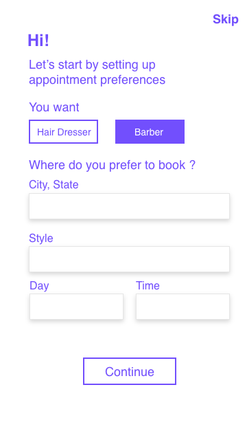
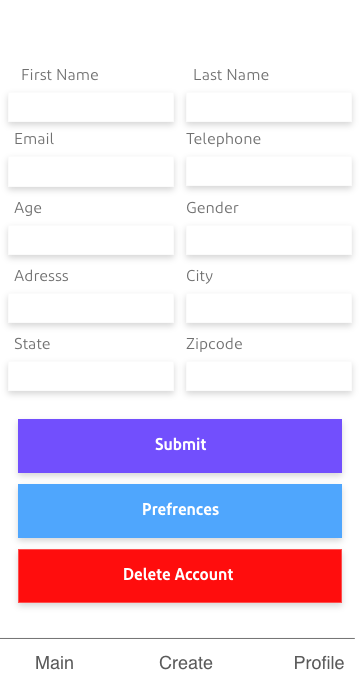
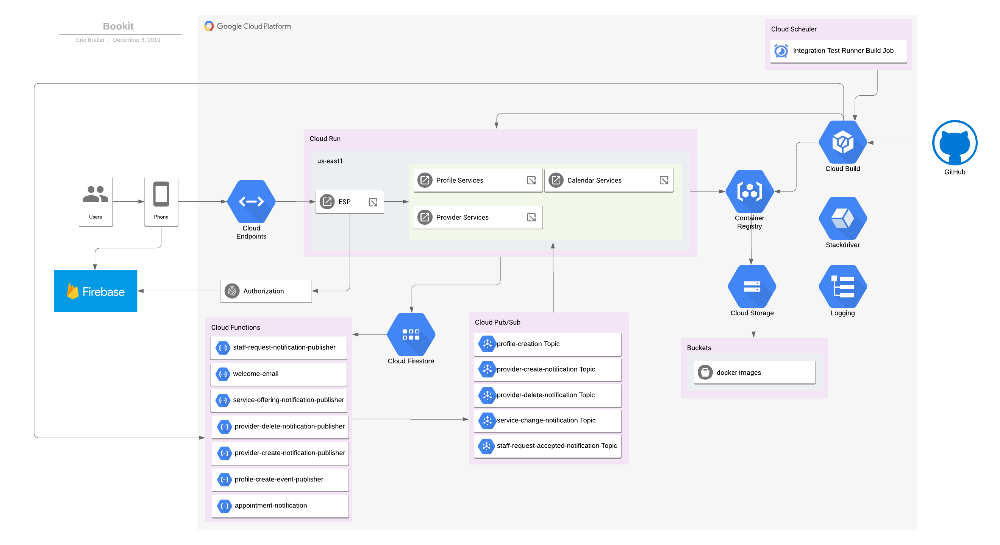

# Contents

- [Application Overview](#Application-Overview)
- [Link Pending - Project Management and Tracking]()
- [Link Pending - Requirements Specification]()
- [Link Pending - User Stories]()
- [UI Mocks](#UI-Mocks)
  -[Login with Email](#Login-With-Email)
  -[User Prefrences](#Prefrences)
  -[Create Appointment](#Create-Appointment)
  -[Account Dashboard](#Account-Dashboard)
  -[View More Appointments](#View-More-Appointments)
  -[View Appointment Details](#View-Appointment-Details)
  -[Edit Appointment](#Edit-Appointment)
- [Architecture & Design](#Architecture-&-Design)
  - [Infrastructure Level Architecture](#Infrastructure-Level-Architecture)
  - [Application Level Architecture](#Application-Level-Architecture)
  - [Technical Components](#Technical-Components)
  - [Data Model](#Data-Model)
  - [Client Facing API Descriptions](https://endpointsportal.bookit-app-260021.cloud.goog/)
- [Deployment](#Deployment)
- [Testing Strategy](./docs/Test_Plan.doc)
    - [Integration Test Runner](https://github.com/bookit-app/integration-test-runner)

# Application Overview

Book It is a mobile application that allows its users to schedule appointments with their local barbers by simply selecting a location then proceeding to choose a date and time to ensure their barber’s availability in order to schedule an appointment in advance. The purpose of this application is to help our users avoid long and unnecessary wait times. It also allows for barbershops to have a more balanced workflow by having immediate access to all scheduled appointments they may have throughout a given workday.
## UI Mocks 

 ### Login with Email                    ### Prefrences
 
## Create Appointment

## Account Dashboard 

## Profile

## View More Appointments

## View Appointment Details

## Edit Appointment

## Architecture & Design

 
### Infrastructure Level Architecture

The following describes the components that will be used for the application along with statements from the Google docs about the components and some reasoning why we leveraged them for this project:

- [Cloud Endpoints](https://cloud.google.com/endpoints/docs/)

  - **What is it?**: Endpoints is an API management system that helps secure, monitor, analyze, and set quotas on APIs using the same infrastructure Google uses for its own APIs.
  - **Why we used it**: This is used at the API Gateway for all backend HTTP(s) based APIs for the project. Cloud Endpoints also provides the means to integrate the backend with authentication of users by enforcing a security policy and delegating token verification to the firebase infrastructure.

- [Cloud Run](https://cloud.google.com/run/docs/)

  - **What is it?**: Cloud Run is a managed compute platform that automatically scales stateless containers. Cloud Run is serverless: it abstracts away all infrastructure management, allowing us to focus only on the business application.
  - **Why we used it**: As the compute runtime for most all of the micro-services which make up the bookit-apps backend

- [Cloud Functions](https://cloud.google.com/functions/docs/)

  - **What is it?**: Google Cloud Functions is a lightweight compute solution for developers to create single-purpose, stand-alone functions that respond to Cloud events without the need to manage a server or runtime environment.
  - **Why we used it**: To hook into Firestore and other Firebase triggers to generate background notifications and pubsub event messages

- [Cloud Firestore](https://cloud.google.com/firestore/docs/)

  - **What is it?**: Cloud Firestore is a NoSQL document database built for automatic scaling, high performance, and ease of application development.
  - **Why we used it**: The backend data storage

- Mobile Application

  - **What is it?**: The client application built as a react native application
  - **Why we used it**: To provide the client an front-end ui in both iso/android

- [Cloud Storage](https://cloud.google.com/storage/docs/)

  - **What is it?**: Cloud Storage allows world-wide storage and retrieval of any amount of data at any time
  - **Why we used it**: This was used indirectly to store the docker images which are deployed into cloud run

- [Firebase Auth](https://firebase.google.com/docs/auth)

  - **What is it?**: Firebase Auth allows for a quick and easy way to set-up user authentication
  - **Why we used it**: Used to provider a user based for the application and means to onboard, and authenticate end users to the application

- [Logging & Stackdriver](https://cloud.google.com/stackdriver/docs/)

  - What is it?: Application Logging and application monitoring tools provided by Google Cloud Platform
  - Why we used it: This is user for monitoring and understanding of what is going on within the application are runtime

- [MailGun](https://www.mailgun.com/): External service used to send emails from the cloud application

### Application Level Architecture

### Technical Components

This following list of links provides the references which contain documentation pertaining to each implementation related element of the application level architecture.

- Cloud Run Services

  - [API Gateway](https://github.com/bookit-app/api-gateway): Specification for the Client Facing APIs exposed to the outside world
  - [Profile Services](https://github.com/bookit-app/profile-services): Set of services related to a users profile
  - [Provider Services](https://github.com/bookit-app/provider-services): Set of services related to Service Providers
  - [Calendar Services](https://github.com/bookit-app/calender-services): Set of services related to calendar and appointment management

- Cloud Functions

  - [Staff Request Accepted Notification Publisher](https://github.com/bookit-app/staff-request-accepted-notification-publisher): Cloud Function which generates pubsub notifications based on firestore triggers
  - [Service Offering Notification Publisher](https://github.com/bookit-app/service-offering-notification-publisher): Cloud Function which generates pubsub notifications based on firestore triggers
  - [Provider Delete Notification Publisher](https://github.com/bookit-app/provider-delete-notification-publisher): Cloud Function which generates pubsub notifications based on firestore triggers
  - [Provider Create Notification Publisher](https://github.com/bookit-app/provider-create-notification-publisher): Cloud Function which generates pubsub notifications based on firestore triggers
  - [Profile Creation Notification Publisher](https://github.com/bookit-app/profile-create-event-publisher): Cloud Function which triggers notifications based on firestore triggers
  - [Appointment Notification](https://github.com/bookit-app/appointment-notification): Cloud Function which triggers notifications based on firestore triggers
  - [Welcome Email Function](https://github.com/bookit-app/welcome-email-function): Cloud Function which triggers email notifications based on firebase auth triggers

- Clients
  - [Mobile Client Application](https://github.com/bookit-app/capstoneSweng894)

### Data Model

The book it app data model is based on a NoSQL approach leveraging cloud firestore. Cloud firestore organizes data based on 2 primary concepts:

- Documents: A document is a lightweight record that contains fields, which map to values. Each document is identified by a name.
- Collections: Documents live in collections, which are simply containers for documents.

Refer to the [Google Cloud Documentation](https://cloud.google.com/firestore/docs/data-model) for more details on how information is structured and organized within firestore.

Each micro-service application contains its own dedicated data model which is only accessed by services pertaining to that functional area. For example, the profile-services defines its own data model and no other service outside of the scope of the profile-services directly accesses its underlying model. This provides us a clear separation of concerns, ownership of data, and enables us to evolve and adjust the underlying data model, and/or technology as required. Refer to each service for the data model specifics.

- [Profile Services](https://github.com/bookit-app/profile-services#data-model)
- [Provider Services](https://github.com/bookit-app/provider-services#data-model)
- [Calendar Services](https://github.com/bookit-app/calender-services#data-flow-diagram)

### Security

In order to ensure the application is secured we have ensured the following for all services which are running:

- No access to the cloud project is granted beyond the maintainers and the automation tooling
- For any services for cloud functions we have deployed access is disabled for invocation from outside of GCP and they require the necessary IAM access rights on the users to invoke them.
- In order to invoke the endpoints of the API Gateway users are required to be created and authenticated. Access is granted via ESP which is enforcing user based authentication and all operations are performed in the context of the user.
- For internal communication service accounts with restricted access rights are leveraged to ensure we are following best practices

### Deployment

The deployment of the application is done in two parts:

- Infrastructure deployment: As the cloud backend is rather simplistic and made up of serverless components the baseline infrastructure setup was triggered via a set of shell commands using the gcloud CLI. As it was not needed for the project to implement this via Infrastructure as Code or required to be repeated in an automated means this was just done manually. Nevertheless this can be easily done and implemented if necessary. The following tasks were performed to setup the base level infrastructure:
  - Enable the Cloud Run, Build, Scheduler, Service Control, Service Management, Container Registry, Firestore, Functions, Logging, and Stackdriver
  - Configure Firestore basic settings as the Native DB and the US East region
  - Setup the necessary KMS keys for encryption of secrets
  - Configured the Github organization and Cloud build triggers with the github app
  - Setup the needed Cloud Pubsub topics for the entire application
  - Created the necessary service accounts and allocated appropriate roles following the principle of Least Privilege

- Application Deployments:
  - Service Deployments: Each service which is deployed is wrapped into a docker image and pushed to the Google Cloud Container Registry. From there revisions are created within Cloud Run and when ready traffic is routed to the new revision. This is triggered based on merging of the codebase to the master branch in github. When this even occurs the Cloud Build github app triggers the packaging and deployment process.
  - Function Deployments: This is triggered based on merging of the codebase to the master branch in github. When this even occurs the Cloud Build github app triggers the packaging and deployment process.

The deployment process is repeatable and automatized, and if we needed to bring the landscape up onto a new environment it is just a matter of adjusting the project, region, and environment variables necessary and triggering the runs via Cloud Build

The below diagram shows the pathway (red lines) and the components which enable the automated deployment. This occurs once code is merged onto the master branch within the github repos.

1. Code is merged onto the master branch and Cloud build is notified to start the process
2. Docker images are pushed to the gcr.io docker repo or if the code base is related to a cloud function pushed to the functions runtime
3. Cloud run revisions are created for the app services and the newly created images generated in step 2 are pulled from gcr.io. Once the revision is up and healthy new traffic is routed from the old revision to the new one so that the new code is executed.

## Testing Strategy

### Objective

To be provided.

### Strategy

- **Unit tests** are implemented for each repository. The unit tests are run in an automated fashion at various levels:
    - When code is committed the unit tests are automatically triggered. If they fail the commit is blocked. This is to ensure all changes are appropriate tested and that there are no unintended consequences.
    - When the Pull Request is opened on github the unit tests as well as linting is performed to ensure high quality of the code.

- **Integration, System, and Security tests** are implemented via a set of Postman collections and integrated with the CI/CD pipeline to be run periodically and automatically. 
    - Refer to the [Integration Test Runner](https://github.com/bookit-app/integration-test-runner) for details on the scenarios, and what is currently covered.
    - Access to the integration tests are located in Cloud Build and can be accessed [here](https://console.cloud.google.com/cloud-build/builds?project=bookit-app-260021&query=tags%3D%20%22integration-tests%22). Note requires authenticated access to the GCP Project.

### Test Cases

Test cases are defined within our project in [Azure Devops](). You can access the content of the test cases there. Additionally, for traceability the test cases implemented within the integration tests mentioned above are demarcated with the test case ID's so we know specifically which are passing or failing.
