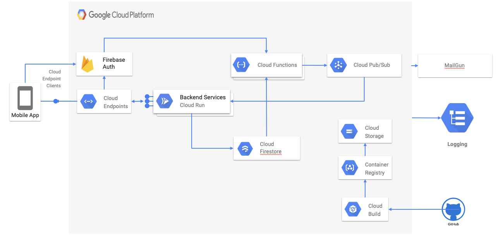

# documentation

All documentation relevant for the Bookit App Capstone project can be found linked below.

# Overview

Book It is a mobile application that allows its users to schedule appointments with their local barbers by simply selecting a location then proceeding to choose a date and time to ensure their barber’s availability in order to schedule an appointment in advance. The purpose of this application is to help our users avoid long and unnecessary wait times. It also allows for barbershops to have a more balanced workflow by having immediate access to all scheduled appointments they may have throughout a given workday.

- [User Stories](./user-stories)
- [UI Mocks]()
- [Requirements Specification]()
- [Domain Model]()

## Technical Details

The Book-it app is broken down into a client mobile app and a set of micro-services and infrastructure technology components running on Google Cloud Platform.

### Infrastructure Level Architecture

The following describes the components that will be used for the application along with statements from the Google docs about the components and some reasoning why we leveraged them for this project:

- [Cloud Endpoints](https://cloud.google.com/endpoints/docs/)
    - **What is it?**: Endpoints is an API management system that helps secure, monitor, analyze, and set quotas on APIs using the same infrastructure Google uses for its own APIs.
    - **Why we used it**: This is used at the API Gateway for all backend HTTP(s) based APIs for the project. Cloud Endpoints also provides the means to integrate the backend with authentication of users by enforcing a security policy and delegating token verification to the firebase infrastructure.

- [Cloud Run](https://cloud.google.com/run/docs/)
    - **What is it?**: Cloud Run is a managed compute platform that automatically scales stateless containers. Cloud Run is serverless: it abstracts away all infrastructure management, allowing us to focus only on the business application.
    - **Why we used it**: As the compute runtime for most all of the micro-services which make up the bookit-apps backend

- [Cloud Functions](https://cloud.google.com/functions/docs/)
    - **What is it?**: Google Cloud Functions is a lightweight compute solution for developers to create single-purpose, stand-alone functions that respond to Cloud events without the need to manage a server or runtime environment.
    - **Why we used it**: To hook into Firestore and other Firebase triggers to generate background notifications and pubsub event messages
    
- [Cloud Firestore](https://cloud.google.com/firestore/docs/) 
    - **What is it?**: Cloud Firestore is a NoSQL document database built for automatic scaling, high performance, and ease of application development.
    - **Why we used it**: The backend data storage

- Mobile Application
    - **What is it?**: The client application built as a react native application
    - **Why we used it**: To provide a client of the users

- [Cloud Storage](https://cloud.google.com/storage/docs/) 
    - **What is it?**: Cloud Storage allows world-wide storage and retrieval of any amount of data at any time
    - **Why we used it**: This was used indirectly to store the binary files for the generated docker images which are deployed into cloud run

- [Firebase Cloud Messaging]()
    - **What is it?**:
    - **Why we used it**: This was going to be leveraged for push notifications. However, due to time constraints this was not yet implemented.

- [Firebase Auth]()
    - **What is it?**:
    - **Why we used it**: Used to provider a user based for the application and means to onboard, and authenticate end users to the application

- [Logging & Stackdriver]()
    - What is it?:
    - Why we used it:

### Application Level Architecture

- Components
  - [API Gateway](https://github.com/bookit-app/api-gateway)
  - [Profile Services](https://github.com/bookit-app/profile-services): Set of services related to a users profile
  - [Provider Services](https://github.com/bookit-app/profile-services): Set of services related to Service Providers
  - [Calendar Services](https://github.com/bookit-app/profile-services): Set of services related to calendar and appointment management
  - [Service Offering Notification Publisher](https://github.com/bookit-app/service-offering-notification-publisher)
  - [Provider Delete Notification Publisher](https://github.com/bookit-app/provider-delete-notification-publisher)
  - [Welcome Email Generator](https://github.com/bookit-app/welcome-email-function)
  - [Profile Creation Notification Publisher](https://github.com/bookit-app/profile-create-event-publisher)

### Data Model

The book it app data model is based on a NoSQL approach leveraging cloud firestore. Cloud firestore organizes data based on 2 primary concepts:

- Documents: A document is a lightweight record that contains fields, which map to values. Each document is identified by a name.
- Collections: Documents live in collections, which are simply containers for documents.

Refer to the [Google Cloud Documentation](https://cloud.google.com/firestore/docs/data-model) for more details on how information is structured and organized within firestore.

Each micro-service application contains its own dedicated data model which is only accessed by services pertaining to that functional area. For example, the profile-services defines its own data model and no other service outside of the scope of the profile-services directly accesses its underlying model. This provides us a clear separation of concerns, ownership of data, and enables us to evolve and adjust the underlying data model, and/or technology as required. Refer to each service for the data model specifics.

- [Profile Services](https://github.com/bookit-app/profile-services#Data-Model)
- [Provider Services](https://github.com/bookit-app/provider-services#Data-Model)
- [Calendar Services](https://github.com/bookit-app/calendar-services#Data-Model)

### Security

- No external access without proper IAM roles
- Access granted via ESP which is enforcing user based authentication
- Access granted to Specific GCP IAM users as needed like o the account level pubsub user to enable push notifications for messages arriving on topics with subscriptions.

### Deployment

- Cloud Build used for build and deployment
- Each service it warped into a docker image and pushed to gcr.io
- Each service contains its own build setup which is triggered in a dedicated build run via the repos parent build
- The build is broken down into 2 phases
  - On the opening of a pull request a build is triggered which runs the linting and automated unit tests to ensure the code changes within the PR are quality changes
  - On merge to the master branch the build/push of the docker images are processed and a new revision is created in Cloud Run to finalize the deployment

### API Overview

- [API Overview](https://endpointsportal.sweng-581-capstone.cloud.goog/)

## Testing

- Unit tests are implemented for each repository. Refer to the respective component repo for details on the unit tests and coverage reports.
- Integration, System, and Security tests are implemented via a set of Postman collections and integrated with the CI/CD pipeline to be run periodically and automatically. Refer to the [Integration Test Runner](https://github.com/bookit-app/integration-test-runner) for details on the scenarios, and what is currently covered. Access to the integration tests are located in Cloud Build and can be accessed [here](https://console.cloud.google.com/cloud-build/builds?project=bookit-app-260021&query=tags%3D%20%22integration-tests%22). Note requires authenticated access to the GCP Project.
