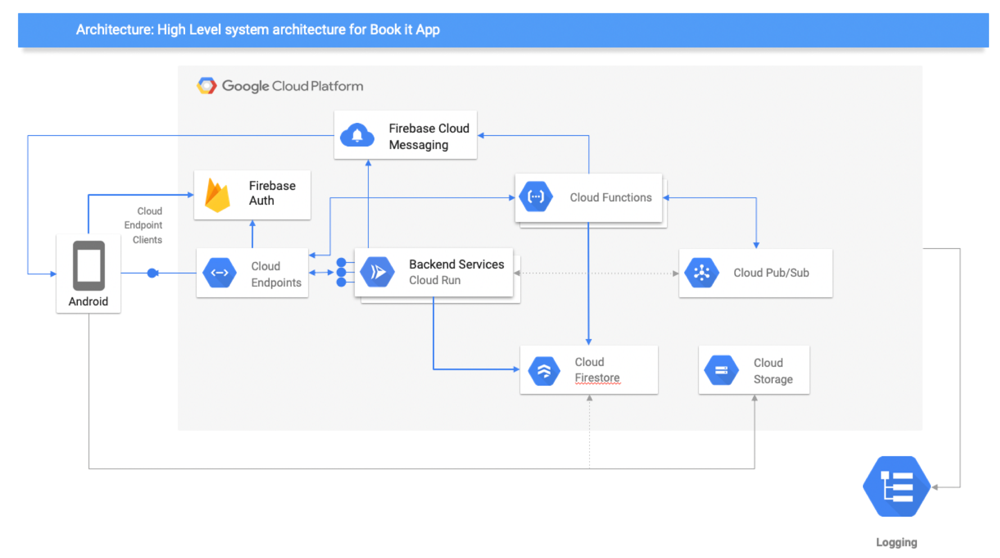

# Bookit Architecture Overview

Bookit is comprised of a Mobile App and a Cloud Backend on GCP.

## High Level Architecture

The following describes the components that will be used for the application along with the reasoning:

* Cloud Endpoints:
* Cloud Run:
* Cloud Functions:
* Cloud Firestore:
* Mobile Application:
* Cloud Storage: 
* Firebase Cloud Messaging:
* Firebase Auth:
* Logging & Stackdriver:

## Further Details

* [Detailed Breakdown](detailed.md)
* [Data Flow](dataflow.md)
* [Security](security.md)
* [Data Model](datamodel.md)
* [Services](services.md)
* [User Management](usermanagement.md)
* [Operations](operations.md)

## Out of Scope

Not sure if we are required to have something like this for the class but probably good that we mention things we purposefully didn't consider due to time constraints and cost.